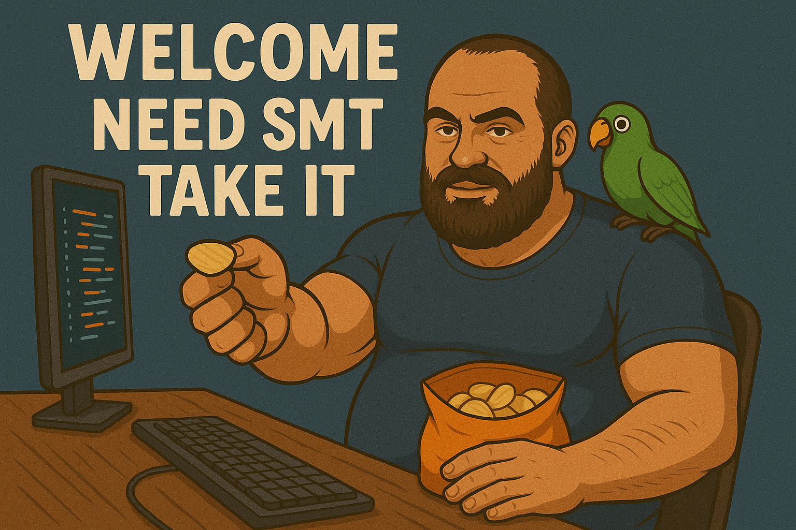

# Hi, I'm Roman Correa

**Data Scientist & Student**  
Serious guy; my word is my bond.

---

## 🧑‍💻 About Me

I'm a dedicated data scientist and student deeply passionate about extracting insights from data to solve real-world problems. I believe in precision, reliability, and always delivering on my commitments.

---

## 🛠️ Top Skills

- **Python** (my primary tool for data analysis and machine learning)
- **SQL** (efficient database querying and manipulation)
- **Machine Learning** (applied to practical projects)

---

## 🚀 Notable Project

### [Vehículos Proy](https://github.com/roman-correa/vehiculos_proy)
A comprehensive project focusing on vehicle data analysis—demonstrating my proficiency in data wrangling, modeling, and actionable insights. Was done by using Python as code, streamlit as the framework to show results and graphics and all that stuff in render.
Use pandas, seaborn..... and all libraries located in requirements.txt

---

## 🎮 Hobbies

- World of Warcraft
- Exploring new datasets & building models for fun

---

## 🌐 Connect with Me

- [LinkedIn](https://www.linkedin.com/in/bigcelph/)
- [YouTube](https://www.youtube.com/channel/UCDmz9t06U--FOe4jvE6pEEw)

---

> “Serious guy; my word is my bond.”

